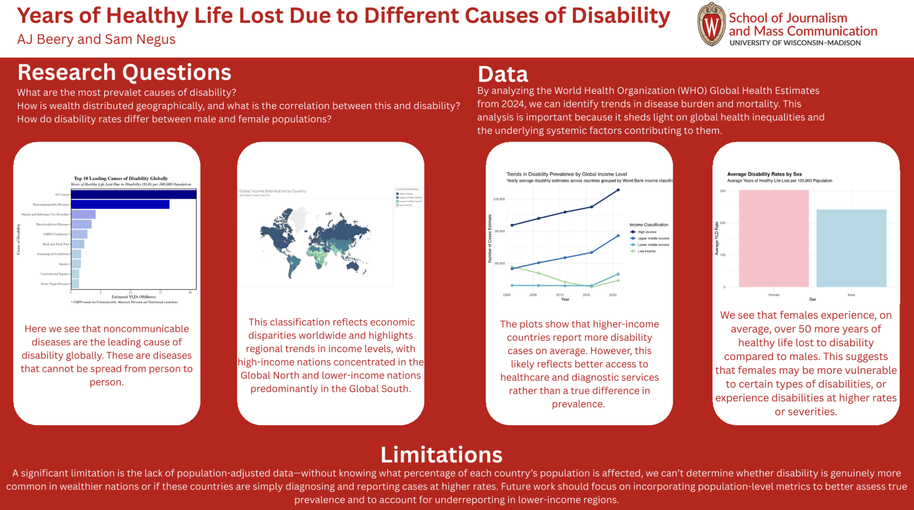

In this project, I created a data analytics dashboard to display solutions of research questions based on global causes of disability:

- What are the most prominent causes of disability globally?
- What is the relationship between regional income class and the number of disability cases?
- How do disability rates differ between males and females?

Along with visualizing these results, data cleaning and aggregative analysis were done beforehand.

