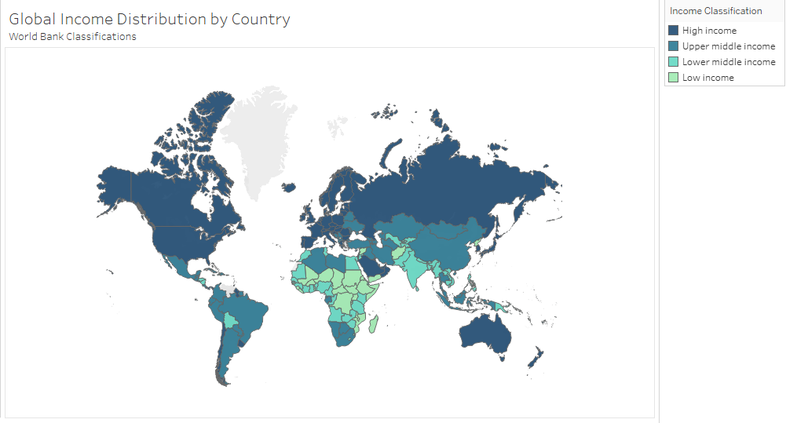

## Years of Healthy Life Lost Due to Different Causes of Disability

This topic is of great interest because it provides critical insights into global health inequalities by examining mortality rates, disability-adjusted life years, and other key health indicators. Researching this topic is essential for informed decision-making on health policies, resource allocation, and addressing disparities in healthcare access and outcomes. By analyzing the World Health Organization (WHO) Global Health Estimates, we can identify trends in disease burden and mortality, ultimately contributing to more effective public health interventions and strategies.

```{r}
# Loading packages and dataset
library(tidyverse)
library(dplyr)
library(ggplot2)
library(knitr)
library(RColorBrewer)
library(scales)
disability_data = read_csv("disability_data.csv")
```

**What are the most prevalet causes of disability?**

```{r}
# Plot 1
disability_data %>%
  mutate(indicator_shortened = case_when(
    indicator_name == "0.0.0 All Causes (YLDs per 100 000 population)" ~ "All Causes", 
    indicator_name == "2.0.0 Noncommunicable diseases (YLDs per 100 000 population)" ~ "Noncommunicable Diseases",
    indicator_name == "2.E.0 Mental and substance use disorders (YLDs per 100 000 population)" ~ "Mental and Substance Use Disorders",
    indicator_name == "2.M.0 Musculoskeletal diseases (YLDs per 100 000 population)" ~ "Musculoskeletal Diseases",
    indicator_name == "1.0.0 Communicable, maternal, perinatal and nutritional conditions (YLDs per 100 000 population)" ~ "CMPN Conditions*",
    indicator_name == "2.M.04 Back and neck pain (YLDs per 100 000 population)" ~ "Back and Neck Pain",
    indicator_name == "2.F.0 Neurological conditions (YLDs per 100 000 population)" ~ "Neurological Conditions",
    indicator_name == "3.0.0 Injuries (YLDs per 100 000 population)" ~ "Injuries",
    indicator_name == "3.A.0 Unintentional injuries (YLDs per 100 000 population)" ~ "Unintentional Injuries",
    indicator_name == "2.G.0 Sense organ diseases (YLDs per 100 000 population)" ~ "Sense Organ Diseases",
    TRUE ~ indicator_name
  )) %>%
  group_by(indicator_shortened) %>%
  summarize(total_estimate_millions = sum(estimate, na.rm = TRUE) / 1000000) %>%
  arrange(desc(total_estimate_millions)) %>%
  head(10) %>%
  ggplot(aes(x = reorder(indicator_shortened, total_estimate_millions), y = total_estimate_millions)) +
  geom_col(aes(fill=total_estimate_millions)) +
  coord_flip() + scale_fill_gradientn(
  colours = c("lightblue", "blue", "darkblue"),
) + scale_y_continuous(expand=c(0, 0)) + labs(
  title = "Top 10 Leading Causes of Disability Globally",
  subtitle = "Years of Healthy Life Lost Due to Disability (YLD) per 100,000 Population",
  y = "Estimated YLDs (Millions)",
  x = "Cause of Disability",
  caption = "* CMPN stands for Communicable, Maternal, Perinatal and Nutritional conditions") + theme(plot.title=element_text(hjust=0.1, face='bold'), plot.subtitle=element_text(face="italic"), text=element_text(family='serif'), 
  plot.caption = element_text(hjust = 0),
  panel.background=element_rect(fill='white'),
  panel.grid.major=element_blank(),
  panel.grid.minor=element_line(),
  panel.border=element_rect(color='black', fill=NA, linewidth=1.25),
  legend.position="none"
)
```

___

Here we see that noncommunicable diseases are the leading cause of disability globally. These are diseases that cannot be spread from person to person. For example, cardiovascular disease or cancer would be considered noncommunicable. The rest of the top 3 causes consist of mental health disorders and substance use (PTSD, schizophrenia, codeine use, fentanyl use, etc.) and musculoskeletal diseases (injuries or diseases affecting muscles, tendons, ligaments, bones, nerves, etc.). 

___


**How is wealth distributed geographically, and what is the correlation between this and disability?**

```{r}
# Add Tableau plot

```
___

This map illustrates the Global Income Distribution by Country, based on World Bank Classifications. Countries are categorized into four income groups using color coding. This classification reflects economic disparities worldwide and highlights regional trends in income levels, with high-income nations concentrated in the Global North and lower-income nations predominantly in the Global South. This information can be used to analyze the distribution between wealth and disability.

___


```{r}
country_year_avg <- disability_data %>%
  group_by(setting, date) %>%
  summarize(
    average_estimate = sum(estimate, na.rm = TRUE),
    count = n(),
    .groups = "drop"
  ) %>%
  arrange(setting, date)

# Create separate dataframe for country-income relationship
country_income <- disability_data %>%
  select(setting, wbincome2024) %>%
  distinct()

# Join the datasets
country_year_avg_with_income <- country_year_avg %>%
  left_join(country_income, by = "setting") %>%
  filter(!is.na(wbincome2024)) %>%
  group_by(date, wbincome2024) %>%
  summarize(
    yearly_avg = mean(average_estimate, na.rm = TRUE),
    countries_count = n(),
    .groups = "drop") %>%
  mutate(wbincome2024 = factor(wbincome2024, 
                              levels = c("Low income", "Lower middle income", "Upper middle income", "High income")))


ggplot(country_year_avg_with_income, 
       aes(x = date, y = yearly_avg, group = wbincome2024, color = wbincome2024)) +
  geom_line(size = 1.5) +
  geom_point(size = 3) +
  labs(
    title = "Trends in Disability Prevalence by Global Income Level",
    subtitle = "Yearly average disability estimates across countries grouped by World Bank income classifications",
    x = "Year",
    y = "Number of Cases Estimate",
    color = "Income Classification"
  ) +
  theme_minimal() +
  scale_color_manual(values = c(
    "High income" = "#08306B",
    "Upper middle income" = "#2171B5",
    "Lower middle income" = "#41B6C4",
    "Low income" = "#A1D99B"
  )) +
  scale_y_continuous(labels = comma) +  # <- makes y-axis human-readable
  guides(color = guide_legend(reverse = TRUE))

```

___

The plots show that higher-income countries report more disability cases on average. However, this likely reflects better access to healthcare and diagnostic services rather than a true difference in prevalence. Wealthier nations typically have stronger health systems and more comprehensive data reporting, making it easier to identify and record disabilities. In contrast, underreporting is common in lower-income countries due to limited healthcare access and diagnostic capacity. Thus, the observed trend may highlight disparities in healthcare infrastructure rather than actual differences in disability rates.
___

**How do disability rates differ between male and female populations?**

```{r}
# Summarizing by sex
disability_by_sex <- disability_data %>%
  filter(subgroup %in% c("Male", "Female")) %>%
  group_by(subgroup) %>%
  summarize(avg_disability_rate = mean(estimate, na.rm = TRUE))

# Plot
ggplot(disability_by_sex, aes(x = subgroup, y = avg_disability_rate, fill = subgroup)) +
  geom_col() +
  labs(
    title = "Average Disability Rates by Sex",
    subtitle = "Average Years of Healthy Life Lost per 100,000 Population",
    x = "Sex",
    y = "Average YLD Rate"
  ) +
  scale_fill_manual(values = c("pink", "lightblue")) +
  theme_minimal() +
  theme(
    plot.title = element_text(face = "bold"),
    legend.position = "none"
  )
```

___

Analyzing this graph, we see that females experience, on average, over 50 more years of healthy life lost to disability compared to males. This suggests that females may be more vulnerable to certain types of disabilities, or experience disabilities at higher rates or severities. In addition, some health conditions unique to females (such as maternal health disorders) may contribute to this increased burden.

___
